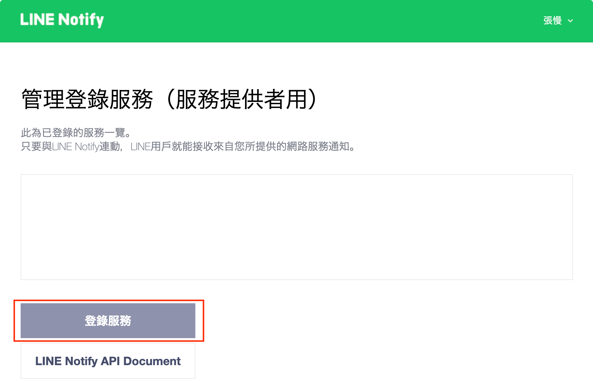
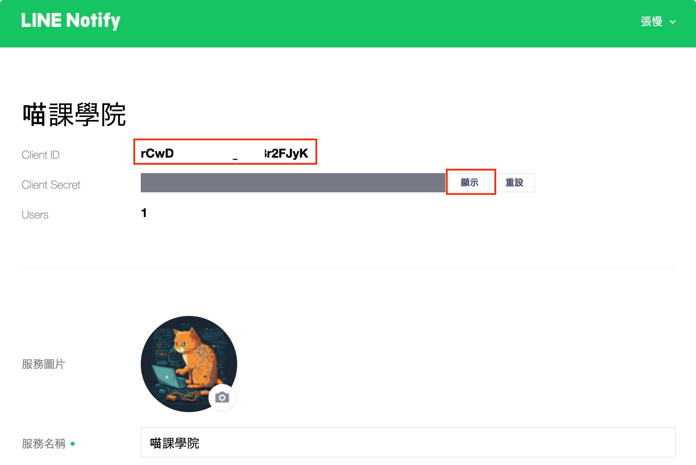

Please see [this repo](https://github.com/laravel-notification-channels/channels) for instructions on how to submit a
channel proposal.

# Line Notify Laravel Notification Channel

[](https://packagist.org/packages/hsuan1117/line-notify-channel)
[](LICENSE.md)
[](https://travis-ci.org/hsuan1117/line-notify-channel)
[](https://styleci.io/repos/:style_ci_id)
[](https://insight.sensiolabs.com/projects/:sensio_labs_id)
[](https://scrutinizer-ci.com/g/hsuan1117/line-notify-channel)
[](https://scrutinizer-ci.com/g/hsuan1117/line-notify-channel/?branch=master)
[](https://packagist.org/packages/hsuan1117/line-notify-channel)

This package makes it easy to send notifications using [LINENotify](https://notify-bot.line.me/) with Laravel 8+.  
To use this package, you must have a [LINENotify](https://notify-bot.line.me/) account.


## Contents

- [Installation](#installation)
    - [Setting up the LINENotify service](#setting-up-the-LINENotify-service)
- [Usage](#usage)
    - [Create Service](#create-service)
    - [Set up the credentials](#set-up-the-credentials)
    - [Use it for the notification](#use-it-for-the-notification)
- [Changelog](#changelog)
- [Testing](#testing)
- [Security](#security)
- [Contributing](#contributing)
- [Credits](#credits)
- [License](#license)

## Installation

You can install the package via composer:

```bash
composer require hsuan1117/line-notify-channel
```

### Setting up the LINENotify service

Optionally include a few steps how users can set up the service.

## Usage


#### Create service

1. Use the button to create service.
   

2. You can get your client ID and client secret from the service page.
   

#### Set up the credentials

Add your LINE Notify client ID and client secret to your `.env` file:

```dotenv
LINE_NOTIFY_CLIENT_ID=your-client-id
LINE_NOTIFY_CLIENT_SECRET=your-client-secret
```

#### Use it for the notification
Add to via() method in your notification class:

```php
public function via($notifiable)
{
    return [LineNotifyChannel::class];
}
```

Add routeNotificationForLINENotify() method in your notification class:
```php
public function routeNotificationForLINENotify($notifiable)
{
    return $notifiable->line_notify_token;
}
```

Add to toLINENotify() method in your notification class:
```php
public function toLINENotify(object $notifiable): LINENotifyMessage
{
    return new LINENotifyMessage('Hello World!');
}
```


#### Configure the callback URL (not included in this package)

**Here is an example, use it at your own scenario**

1. Create a route for the callback URL

```php
Route::prefix('line-notify')->group(function () {
    Route::post('gen', [LineNotifyController::class, 'generateLinkToken'])->name('line-notify.callback')->middleware('auth:sanctum');
    Route::post('link', [LineNotifyController::class, 'link'])->name('line-notify.callback');
});
```

2. Create a controller for the callback URL

```php
<?php
namespace App\Http\Controllers;

use Illuminate\Http\Request;
use Illuminate\Support\Facades\Auth;
use Illuminate\Support\Facades\Session;
use Illuminate\Support\Facades\URL;

class LineNotifyController extends Controller
{
    public function generateLinkToken() {
        $token = Str::random(40);
        auth()->user()->update([
            'link_token' => $token,
        ]);
        return $token;
    }

    public function link(Request $request)
    {
        $code = $request->get('code');
        $state = $request->get('state');

        $user = User::where('link_token', $state)->firstOrFail();

        $response = Http::asForm()->post('https://notify-bot.line.me/oauth/token', [
            'grant_type' => 'authorization_code',
            'code' => $code,
            'redirect_uri' => config('app.url') . '/line-notify/link',
            'client_id' => config('services.line-notify.client_id'),
            'client_secret' => config('services.line-notify.client_secret'),
        ]);

        $token = $response->json()['access_token'];
        $user->update([
            'line_notify_token' => $token,
        ]);

        return redirect()->to(config('app.frontend_url'));
    }
}
```

3. Usage: put the following code in your frontend

```javascript
const CLIENT_ID = "xxxxxxxxxx";
const BACKEND_URL = `https://your-backend-url.com`;
const LINK_URL = `${BACKEND_URL}/line-notify/link`
const GEN_URL = `${BACKEND_URL}/line-notify/gen`

// 1. Generate link token
const linkToken = await axios.post(GEN_URL, {}, {
    headers: {
        'Authorization': `Bearer ${token}`,
    }
}).then(res => res.data);

// 2. Redirect to LINE Notify authorization page
window.location.href = `https://notify-bot.line.me/oauth/authorize?response_type=code&client_id=${CLIENT_ID}&redirect_uri=${encodeURIComponent(LINK_URL)}&scope=notify&state=${linkToken}&response_mode=form_post`;

// 3. Then the code will automatically redirect to the callback URL
```

## Changelog

Please see [CHANGELOG](CHANGELOG.md) for more information what has changed recently.

## Testing

Not implemented yet. Welcome to contribute.

## Security

If you discover any security related issues, please email hsuan@hsuan.app instead of using the issue tracker.

## Contributing

Please see [CONTRIBUTING](CONTRIBUTING.md) for details.

## Credits

- [Hsuan Chang](https://github.com/hsuan1117)
- [All Contributors](../../contributors)

## License

The MIT License (MIT). Please see [License File](LICENSE.md) for more information.
